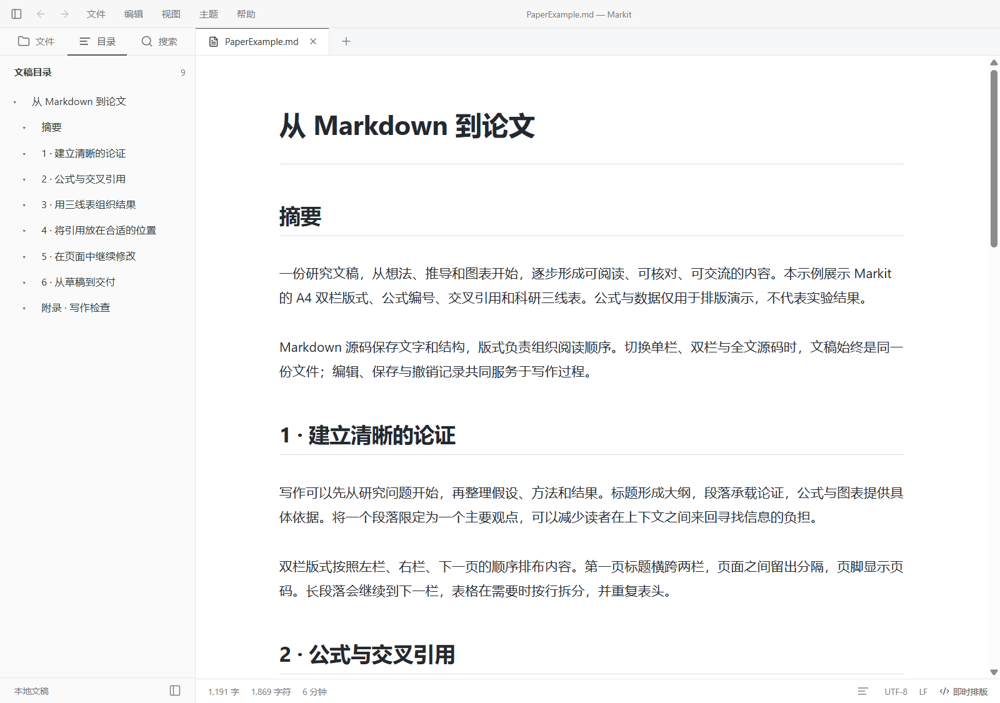

# Markedown

面向日常记录与论文写作的 Windows Markdown 编辑器。

Markedown 将即时排版、公式编号、Zotero 文献引用和多格式导出放在同一个写作环境中。文稿以本地 Markdown 文件保存，可随时切换到源码模式继续编辑。

**[下载最新版](https://github.com/chen-yu-hao/Markitdown/releases/latest)** · [学术写作指南](resources/AcademicWriting.md) · [构建说明](resources/Development.md) · [反馈问题](https://github.com/chen-yu-hao/Markitdown/issues)



## 下载与安装

当前版本：**0.3.7**。支持 **Windows 10 22H2 / Windows 11，x64**。直接使用安装版或便携版无需安装 Node.js。

| 版本 | 下载 | 使用方式 |
| --- | --- | --- |
| 安装版 | [Windows x64 EXE](https://github.com/chen-yu-hao/Markitdown/releases/download/v0.3.7/Markedown-0.3.7-Windows-x64-Setup.exe) | 运行安装程序，按提示选择安装目录 |
| 便携版 | [Windows x64 ZIP](https://github.com/chen-yu-hao/Markitdown/releases/download/v0.3.7/Markedown-0.3.7-Windows-x64.zip) | 完整解压到可写目录，运行 `Markedown.exe` |
| 源码 | [Source code (zip)](https://github.com/chen-yu-hao/Markitdown/archive/refs/tags/v0.3.7.zip) | GitHub 按版本标签生成，包含源码、依赖锁文件、测试和中文说明 |

安装程序会添加 Markdown 文件的“打开方式”选项，不会强制修改默认应用。便携版需保留同目录的 `portable.json` 及其余程序文件。

当前发行包未签名。[发布页](https://github.com/chen-yu-hao/Markitdown/releases/tag/v0.3.7)提供更新说明，Assets 保留安装版、便携版和 GitHub 自动生成的 Source code（zip / tar.gz）。许可证和依赖说明随程序包与源码提供，不再作为单独的发布附件。

### 更新已有版本

更新前保存文稿并退出 Markedown。

- **安装版**：下载新版 EXE，安装到原目录，无需先卸载。设置与恢复数据保存在用户应用数据目录。
- **便携版**：将新版解压到新目录，把旧版的 `data` 目录复制到新版目录中，再启动新版。另行存放的文稿和图片仍在原位置。

目前采用手动更新，可在[最新发布页](https://github.com/chen-yu-hao/Markitdown/releases/latest)获取新版本。

## 主要功能

- **编辑与排版**：即时排版和源码模式；标题、列表、任务列表、表格、代码高亮、删除线、高亮、上下标及 LaTeX 公式。表格支持双击或按 Enter 编辑单元格，Enter 提交、Esc 取消，内容直接写回 Markdown。
- **文稿与工作区**：多标签、多窗口、独立撤销记录、侧栏文件单击打开、文件夹浏览、大纲定位、全文搜索及查找替换。
- **专注写作**：专注模式、打字机模式、字数统计、阅读宽度与字体设置、自定义快捷键。
- **主题与偏好**：内建 Github、Newsprint、Night、Pixyll、Whitey 五种主题，数字使用等高字形，支持深浅色外观和可搜索的分类设置。
- **本地图片**：粘贴、拖入或批量选择图片；默认写入文稿旁的 `assets`，大图使用缓存缩略图预览，保留原图。
- **保存与恢复**：自动保存、异常退出恢复、外部修改冲突提示，以及 UTF-8 BOM、LF/CRLF 格式保留。

打开、保存和导出位于 **文件** 菜单，文本格式位于 **编辑 → 格式**，偏好设置位于 **编辑 → 偏好设置**（`Ctrl+,`）。

右键文稿标签可选择 **打开新窗口**、**关闭** 或 **关闭其他标签**。将标签拖离标签条后松开，也可移到独立窗口；按 `Esc` 取消拖动。移窗保留未保存内容、撤销/重做、选区、滚动位置和编辑模式；关闭其他标签仅作用于当前窗口，取消保存确认会保留全部标签。

## 论文写作

### 公式编号与交叉引用

通过 **编辑 → 格式 → 行间公式** 插入公式，默认自动编号。行间公式默认左对齐，编号在右侧并相对公式整体垂直居中；**偏好设置 → Markdown → 数学公式** 可选择公式左对齐、居中或右对齐，以及编号在左侧或右侧。通过 **编辑 → 学术引用 → 文档编号设置** 可为当前文稿单独设置编号前缀；论文补充材料输入 `S` 后自动生成 `S1`、`S2` 等编号，手动 `\\tag{…}` 编号保持不变。

较长公式可通过底部滚动条横向查看。拖动或点击滚动条时保留文稿源码与选区；点击公式内容可进入源码编辑。

为行间公式或行内公式添加标签，即可在正文引用。编号支持全文连续或按一级标题分章，也可只为带标签的公式编号。段落中的公式可通过 **编辑 → 格式 → 行内公式** 插入。

顶层正文段落仅包含一个 `$…$` 或 `\(…\)` 时，默认按行间公式排版并遵循当前编号设置；可在同一设置分组关闭 **独占段落的行内公式按行间公式处理**。正文夹排、标题、列表、引用和表格中的行内公式保持原样，Markdown 源码不改写。

表格默认使用科研三线表（顶线、表头线、底线）。在 **偏好设置 → Markdown → Markdown 语法偏好 → 表格样式** 中可切换为网格表或简洁横线表；样式同时用于即时排版和 HTML/PDF/PNG 导出。表格单元格可双击或聚焦后按 Enter/F2 编辑，Enter 提交、Esc 取消，失焦提交。右键菜单提供选择整行/整列、上下插入行、左右插入列和删除行/列；Shift 单击选择整行，Alt 单击选择整列，Tab 在单元格间移动。所有内容和结构变更均写回 Markdown 并可撤销。

```markdown
能量关系见 \eqref{eq:energy}。

$$
E = mc^2 \label{eq:energy}
$$

行内比值 $\eta = E/E_0\label{eq:ratio}$ 也可通过 \eqref{eq:ratio} 引用。
```

支持 `\eqref{eq:energy}`、`\ref{eq:energy}` 和 `[@eq:energy]` 三种引用写法。增删前文公式后，引用编号随之更新；按住 `Ctrl` 点击引用可定位目标公式。也可通过 **编辑 → 学术引用** 插入标签、引用，或打开“文档编号设置”快速调整编号前缀。

### Zotero 文献引用

启动 Zotero 并启用本地 API 后，在 **偏好设置 → Markdown → 文献引用** 中检查连接。默认连接本机 `http://localhost:23119/api/`，读取 Zotero 个人文库。

按 `Ctrl+Shift+C` 检索并多选插入文献，也可直接输入：

```markdown
相关研究见 [@D9PGQUM4; @T4IQZGRM; @MRHTZ5CI]。
```

示例中的键需替换为自己 Zotero 文库中实际存在的八位条目键。支持顺序编号和作者年份两种引文样式，已解析的文献信息可通过本地缓存离线排版。

首次插入或输入有效引用时，默认在文末生成参考文献列表，并加入独立一行的占位符：

```markdown
<!-- markedown:bibliography -->
```

移动这一行即可调整参考文献的位置，例如放在附录之前。缺失文献和重复公式标签会提示，并要求在导出前处理。

更多编号设置、手动号码和引用用法见[学术写作指南](resources/AcademicWriting.md)与[示例文稿](resources/AcademicExample.md)。

## 导入与导出

导出使用当前编辑内容，包括尚未保存的修改。

| 方式 | 格式 |
| --- | --- |
| 内建导出 | HTML、无样式 HTML、PDF（A4 / Letter）、长图 PNG |
| Pandoc 导出 | Word（DOCX）、EPUB、LaTeX、RTF、ODT、MediaWiki、reStructuredText、Textile、OPML |
| Pandoc 导入 | DOCX、ODT、EPUB、HTML、reStructuredText、Textile、OPML |

使用扩展格式时，需安装 [Pandoc](https://pandoc.org/installing.html)。Markedown 会检查 `PATH` 和常见安装目录，也可在偏好设置中指定 `pandoc.exe`。内建导出无需 Pandoc。

**偏好设置 → 导出 → Word** 可设置中西文字体、颜色、正文和各级标题样式。Word 公式以原生可编辑数学对象导出；公式编号和参考文献列表保留导出时的结果，不是 Word 自动编号域或引文管理器记录。

LaTeX、RST、Textile、MediaWiki 等文本导出会生成相邻的 `markedown-assets-*` 图片目录，移动导出文件时需一并携带。

## 文稿与数据

文稿保存在你选择的位置。图片采用相对路径时，移动文稿也需要同时移动对应图片目录；未保存文稿在首次导入图片时会提示选择保存位置。

| 数据 | 位置 |
| --- | --- |
| 安装版设置、恢复记录与缓存 | 通常为 `%APPDATA%\Markedown` |
| 便携版设置、恢复记录与缓存 | `Markedown.exe` 旁的 `data` 目录 |
| 默认图片目录 | 文稿旁的 `assets`，可在图像设置中调整 |

恢复的文稿需要先手动保存一次，才会重新启用自动写回。遇到外部修改冲突时，可重新加载、另存副本或取消。撤销图片插入会撤销文稿中的 Markdown 文本，已写入的图片文件仍保留。

预览默认阻止远程图片，文稿中的脚本不会执行。HTML 导出可单独允许远程图片；PDF、PNG 和 Pandoc 导出使用本地图片。

## 常用快捷键

| 操作 | 快捷键 |
| --- | --- |
| 新文稿 / 新窗口 | `Ctrl+N` / `Ctrl+Shift+N` |
| 打开文稿 / 文件夹 | `Ctrl+O` / `Ctrl+Shift+O` |
| 保存 / 另存为 | `Ctrl+S` / `Ctrl+Shift+S` |
| 查找 / 替换 | `Ctrl+F` / `Ctrl+H` |
| 撤销 / 重做 | `Ctrl+Z` / `Ctrl+Y` |
| 加粗 / 斜体 | `Ctrl+B` / `Ctrl+I` |
| 源码模式 / 侧栏 | `Ctrl+/` / `Ctrl+Shift+L` |
| 专注 / 打字机模式 | `F8` / `F9` |
| 插入文献 / 公式引用 | `Ctrl+Shift+C` / `Ctrl+Shift+R` |
| 偏好设置 | `Ctrl+,` |

## 当前支持范围

支持 UTF-8 文稿。超过 1 MiB 的文稿默认使用源码模式，超过 5 MiB 强制使用源码模式；工作区搜索最多返回 500 条匹配。

目前不支持 Mermaid 预览、表格合并/拆分、外部主题安装和自动更新。Zotero 当前支持个人文库，暂不支持群组库选择与 Better BibTeX citekey 映射。

已提供 Markdown 语法和文献提供器的[扩展接口](resources/Extensions.md)，供源码层面的功能扩展使用；当前没有外部插件安装入口或插件市场。

## 开发与反馈

从源码运行需要 Windows x64 和 Node.js 24 LTS。在工程目录执行：

```powershell
npm ci
node node_modules/electron/install.js
npm run dev
```

每次重新执行 `npm ci` 后，需要运行上面的 Electron 安装步骤。测试、打包与发布流程见[开发与构建说明](resources/Development.md)，已完成的验证及适用范围见[验证记录](resources/Validation.md)。

欢迎通过 [GitHub Issues](https://github.com/chen-yu-hao/Markitdown/issues)反馈问题或提出功能建议。报告问题时请附上应用版本、Windows 版本、复现步骤及去除个人信息的最小示例；涉及排版或点击定位时，也请注明主题和显示缩放。

第三方组件、图标来源及许可证说明见[第三方与来源说明](resources/ThirdPartyNotices.md)。依赖清单与许可证文本位于程序可执行文件旁，也保存在源码的 `resources` 目录中。
