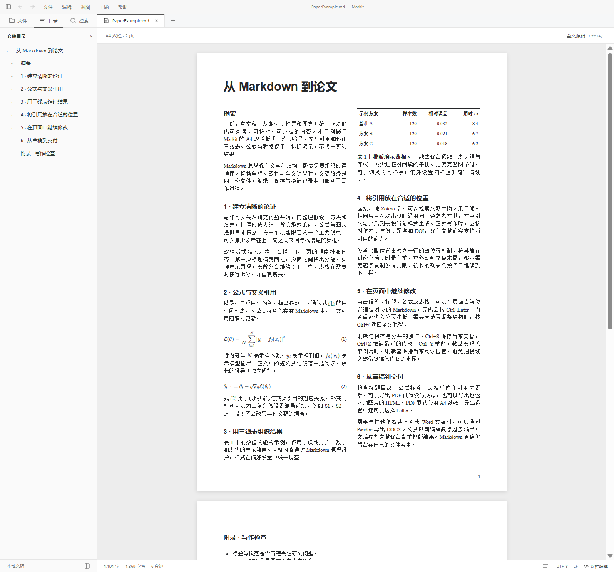

<p align="center">
  
</p>

<h1 align="center">Markit</h1>

<p align="center"><strong>从 Markdown 草稿，到清晰的论文版式。</strong></p>

<p align="center">
  <a href="https://github.com/chen-yu-hao/Markitdown/releases/latest"></a>
  <a href="https://github.com/chen-yu-hao/Markitdown/actions/workflows/release.yml"></a>
  
  
  
</p>

Markit 是面向日常记录与论文写作的桌面 Markdown 编辑器。即时排版、A4 双栏、公式编号和 Zotero 引用在同一份文稿上协作，写完可直接导出 HTML、PDF 或 Word。文稿以本地 Markdown 文件保存，编辑与版式切换共用源码和撤销记录。

**[下载最新版](https://github.com/chen-yu-hao/Markitdown/releases/latest)** · [学术写作指南](resources/AcademicWriting.md) · [构建说明](resources/Development.md) · [反馈问题](https://github.com/chen-yu-hao/Markitdown/issues)



<details>
<summary>查看单栏即时排版界面</summary>


</details>

**快速导航：** [下载与安装](#下载与安装) · [主要功能](#主要功能) · [论文写作](#论文写作) · [设置与个性化](#设置与个性化) · [导入与导出](#导入与导出) · [常用快捷键](#常用快捷键) · [开发与反馈](#开发与反馈)

## 下载与安装

当前发布版本：**0.3.13**，提供 **Windows 10 22H2 / Windows 11 x64** 安装版和便携版，以及 Linux x64 的 AppImage、DEB、RPM 和 tar.gz。构建方法见[开发说明](resources/Development.md)。

| 版本 | 下载 | 使用方式 |
| --- | --- | --- |
| 安装版 | [Windows x64 EXE](https://github.com/chen-yu-hao/Markitdown/releases/download/v0.3.13/Markit-0.3.13-Windows-x64-Setup.exe) | 运行安装程序，按提示选择安装目录 |
| 便携版 | [Windows x64 ZIP](https://github.com/chen-yu-hao/Markitdown/releases/download/v0.3.13/Markit-0.3.13-Windows-x64.zip) | 完整解压到可写目录，运行 `Markit.exe` |
| Linux | [Linux x64 软件包](https://github.com/chen-yu-hao/Markitdown/releases/tag/v0.3.13) | Ubuntu/Debian 使用 DEB，Fedora/RHEL 使用 RPM，其他发行版可使用 AppImage 或 tar.gz |
| 源码 | [Source code (zip)](https://github.com/chen-yu-hao/Markitdown/archive/refs/tags/v0.3.13.zip) | GitHub 按版本标签生成，包含源码、依赖锁文件、测试和中文说明 |

安装程序会添加 Markdown 文件的“打开方式”选项，不会强制修改默认应用。便携版需保留同目录的 `portable.json` 及其余程序文件。

当前发行包未签名。[发布页](https://github.com/chen-yu-hao/Markitdown/releases/tag/v0.3.13)提供更新说明、各平台软件包和 GitHub 自动生成的 Source code（zip / tar.gz）。许可证和依赖说明随程序包与源码提供，不再作为单独的发布附件。

本版应用名称统一为 **Markit**。Windows 安装版继续使用旧版 Markedown 的设置、缓存和恢复数据。

### 更新已有版本

更新前保存文稿并退出 Markit。

- **安装版**：下载新版 EXE，安装到原目录，无需先卸载。设置与恢复数据保存在用户应用数据目录。
- **便携版**：将新版解压到新目录，把旧版的 `data` 目录复制到新版目录中，再启动新版。另行存放的文稿和图片仍在原位置。

目前采用手动更新，可在[最新发布页](https://github.com/chen-yu-hao/Markitdown/releases/latest)获取新版本。

## 主要功能

### Markdown 编辑与导航

- **三种写作视图**：单栏即时排版、全文源码和 A4 双栏论文版式。视图切换保留未保存内容和撤销记录。
- **常用语法**：标题、列表、任务列表、引用、代码高亮、表格、删除线、高亮、上下标、行内与行间 LaTeX 公式。
- **定位长文稿**：大纲跳转、全文行号、查找替换与工作区全文搜索；源码自动折行沿用原行号。
- **专注写作**：专注模式、打字机模式、可调字体、阅读宽度和界面缩放。

### 论文排版与学术引用

- **A4 双栏**：标题通栏、正文双栏、页间分隔和页码；点击内容可编辑对应 Markdown，长表格续栏重复表头。
- **公式编号**：默认给行间公式编号，支持标签、交叉引用、按章节编号及按文档保存的 `S1`、`S2` 等前缀。
- **Zotero 引用**：连接本地个人文库，通过条目键插入引用；支持顺序编号和作者年份样式，已解析文献可离线排版。
- **科研三线表与单元格编辑**：点击表格打开编辑面板，支持行列选择、插入/删除、列对齐、尺寸调整和电子表格多单元格粘贴；默认三线表，可切换网格表和简洁横线表。

### 文件、工作区与保存

- **多标签与多窗口**：标签保留独立撤销记录；右键管理标签，拖出标签可移到新窗口，同一文件跨窗口去重。
- **本地工作区**：侧栏单击打开文件，按需展开文件夹，恢复最近工作区，浏览最近文件。
- **可靠写盘**：保留 UTF-8 BOM 和 LF/CRLF，使用同目录临时文件与原子替换，保存期间继续输入仍保留未保存状态。
- **恢复与冲突处理**：自动保存、异常退出草稿恢复、外部修改检测；恢复的文稿先手动保存，再恢复自动写回。

### 图片、剪贴板与翻译

- **本地图片**：粘贴、拖入或批量选择，默认写入文稿旁的 `assets`；长图按正文宽度等比显示，预览缓存保留原图。
- **复制与粘贴**：文字右键支持复制、剪切和粘贴，图片右键支持复制原图；长文本粘贴保持阅读位置，可整批撤销。
- **选词翻译**：右键翻译选中文字，默认尝试 Google 翻译，也可配置 Google Cloud 或百度翻译凭据。

打开、保存和导出位于 **文件** 菜单，文本格式位于 **编辑 → 格式**，偏好设置位于 **编辑 → 偏好设置**（`Ctrl+,`）。

在文字、源码选区和图片上点击右键可打开复制、粘贴、剪切、翻译菜单；即时排版和双栏阅读中的图片支持“复制图片”，复制的是原始图像而非缩略图。翻译面板默认尝试 Google 翻译，也可在 **偏好设置 → Markdown → 翻译** 中配置 Google Cloud API Key、百度翻译 App ID 和密钥，并选择目标语言。

**视图 → 显示行号** 可切换全文行号，也可在 **偏好设置 → 编辑器 → 行号** 中设置。该选项默认为关闭，开启后全局保存。源码模式逐行连续编号，自动折行沿用原行号；单栏即时排版中的表格、公式等渲染块显示起始源码行号。双栏阅读时开启会转到源码编辑。全文行号不写入文稿或导出结果，代码块内部行号仍可单独设置。

右键文稿标签可选择 **打开新窗口**、**关闭** 或 **关闭其他标签**。将标签拖离标签条后松开，也可移到独立窗口；按 `Esc` 取消拖动。移窗保留未保存内容、撤销/重做、选区、滚动位置和编辑模式；关闭其他标签仅作用于当前窗口，取消保存确认会保留全部标签。

## 论文写作

### A4 双栏论文编辑

在 **视图 → 论文版式 → 双栏（Nature 风格）** 启用，也可在 **偏好设置 → 外观 → 字号与版式** 中设置。文稿以 A4 白纸分页显示，第一页标题通栏，正文按左栏、右栏、下一页排列，带页间空隙和页码；窄窗口按比例缩放整页。公式、三线表、本地图片和 Zotero 参考文献均参与分页，长表格续栏重复表头，长图保持栏宽等比显示。

点击页面中的段落或标题，即可在当前位置编辑该块的 Markdown 源码；表格与公式打开各自的节点编辑面板。段落按 `Ctrl+Enter`、`Esc` 或“完成编辑”重新排版，节点面板点击“完成”返回页面；编辑期间保持页面位置。`Ctrl+S` 保存，`Ctrl+Z` / `Ctrl+Y` 撤销与重做，和全文源码模式共用同一份文稿与撤销记录。`Ctrl+/` 可随时切换到全文源码编辑。

该全局版式选项同步用于 HTML/PDF/PNG 导出，包含当前未保存内容。HTML 为可离线打开的静态分页文件，PDF 默认 A4，也可在导出设置中选择 Letter；PNG 保留页间分隔。DOCX 等 Pandoc 导出使用各自的原有版式。

### 公式编号与交叉引用

通过 **编辑 → 格式 → 行间公式** 插入公式，默认自动编号。行间公式默认左对齐，编号在右侧并相对公式整体垂直居中；**偏好设置 → Markdown → 数学公式** 可选择公式左对齐、居中或右对齐，以及编号在左侧或右侧。通过 **编辑 → 学术引用 → 文档编号设置** 可为当前文稿单独设置编号前缀；论文补充材料输入 `S` 后自动生成 `S1`、`S2` 等编号，手动 `\\tag{…}` 编号保持不变。

较长公式可通过底部滚动条横向查看。拖动或点击滚动条时保留文稿源码与选区；点击公式内容可进入源码编辑。

为行间公式或行内公式添加标签，即可在正文引用。编号支持全文连续或按一级标题分章，也可只为带标签的公式编号。段落中的公式可通过 **编辑 → 格式 → 行内公式** 插入。

顶层正文段落仅包含一个 `$…$` 或 `\(…\)` 时，默认按行间公式排版并遵循当前编号设置；可在同一设置分组关闭 **独占段落的行内公式按行间公式处理**。正文夹排、标题、列表、引用和表格中的行内公式保持原样，Markdown 源码不改写。

点击行内或行间公式，打开 **LaTeX 输入与实时预览** 面板；修改立即同步到文稿，保留原分隔符、标签与编号。行内公式按 `Enter`、行间公式按 `Ctrl+Enter` 完成；`Esc` 还原本次公式修改并退出。方向键在输入边界处可返回正文，长公式的滚动条仍可单独操作。

```markdown
能量关系见 \eqref{eq:energy}。

$$
E = mc^2 \label{eq:energy}
$$

行内比值 $\eta = E/E_0\label{eq:ratio}$ 也可通过 \eqref{eq:ratio} 引用。
```

支持 `\eqref{eq:energy}`、`\ref{eq:energy}` 和 `[@eq:energy]` 三种引用写法。增删前文公式后，引用编号随之更新；按住 `Ctrl` 点击引用可定位目标公式。也可通过 **编辑 → 学术引用** 插入标签、引用，或打开“文档编号设置”快速调整编号前缀。

### Zotero 文献引用

启动 Zotero 并启用本地 API 后，在 **偏好设置 → Markdown → 文献引用** 中检查连接。默认连接本机 `http://localhost:23119/api/`，读取 Zotero 个人文库。

按 `Ctrl+Shift+C` 检索并多选插入文献，也可直接输入：

```markdown
相关研究见 [@D9PGQUM4; @T4IQZGRM; @MRHTZ5CI]。
```

示例中的键需替换为自己 Zotero 文库中实际存在的八位条目键。支持顺序编号和作者年份两种引文样式，已解析的文献信息可通过本地缓存离线排版。

首次插入或输入有效引用时，默认在文末生成参考文献列表，并加入独立一行的占位符：

```markdown
<!-- markedown:bibliography -->
```

移动这一行即可调整参考文献的位置，例如放在附录之前。缺失文献和重复公式标签会提示，并要求在导出前处理。

更多编号设置、手动号码和引用用法见[学术写作指南](resources/AcademicWriting.md)与[示例文稿](resources/AcademicExample.md)。

### 表格节点编辑

单栏和 A4 双栏都支持点击单元格打开表格编辑面板。点击上方的列字母或左侧的行标选择整列/整行，工具栏及右键菜单提供插入、删除行列；还可设置当前列左对齐、居中或右对齐，输入行列数调整表格尺寸。GFM 表格首行始终作为表头；删除表头时，下一行自动成为表头。

`Tab` / `Shift+Tab` 移动到下一个/上一个单元格，`Enter` 前进，末尾自动增加行，`Shift+Enter` 插入单元格内换行。从 Excel 复制的制表符文本可一次粘贴到多个单元格，按需扩展表格。单元格中保留 Markdown 写法，竖线自动转义。修改立即同步到文稿，可保存和撤销；`Esc` 还原当前单元格本次输入。长表格分组显示，每组 50 行；A4 续页表头和单元格映射回原表格。

表格默认使用科研三线表（顶线、表头线、底线）。在 **偏好设置 → Markdown → Markdown 语法偏好 → 表格样式** 中可切换为网格表或简洁横线表；样式同步到单栏、A4 双栏和 HTML/PDF/PNG 导出。源码模式始终可直接修改完整表格。

## 设置与个性化

入口：**编辑 → 偏好设置**（`Ctrl+,`）。设置支持分类浏览与搜索。

| 设置区域 | 可配置内容 |
| --- | --- |
| 文件 | 默认扩展名、自动保存、切换保存、历史记录、拖放行为、文件树过滤 |
| 编辑器 | 全文行号、缩进、自动配对、Emoji 补全、复制 Markdown、拼写检查、打字机模式 |
| 图像 | 本地图片目录、图片插入与资源管理偏好 |
| Markdown | 语法开关、三种表格样式、代码块、公式排版与编号、引文样式、翻译接口 |
| 外观 | 系统／浅色／深色、GitHub／Newsprint／Night／Pixyll／Whitey、字号、阅读宽度、单栏／双栏 |
| 导出 | 格式预设、目录、PDF 纸张、HTML 资源、Pandoc 路径、Word 字体和段落样式 |
| 通用 | 界面语言、快捷键和相关应用选项 |

表格样式、主题和版式是全局偏好；**编辑 → 学术引用 → 文档编号设置** 中的公式编号前缀按文档保存。

## 导入与导出

导出使用当前编辑内容，包括尚未保存的修改。

| 方式 | 格式 |
| --- | --- |
| 内建导出 | HTML、无样式 HTML、PDF（A4 / Letter）、长图 PNG |
| Pandoc 导出 | Word（DOCX）、EPUB、LaTeX、RTF、ODT、MediaWiki、reStructuredText、Textile、OPML |
| Pandoc 导入 | DOCX、ODT、EPUB、HTML、reStructuredText、Textile、OPML |

使用扩展格式时，需安装 [Pandoc](https://pandoc.org/installing.html)。Markit 会检查 `PATH` 和常见安装目录，也可在偏好设置中指定 `pandoc.exe`。内建导出无需 Pandoc。

**偏好设置 → 导出 → Word** 可设置中西文字体、颜色、正文和各级标题样式。Word 公式以原生可编辑数学对象导出；公式编号和参考文献列表保留导出时的结果，不是 Word 自动编号域或引文管理器记录。

LaTeX、RST、Textile、MediaWiki 等文本导出会生成相邻的 `markedown-assets-*` 图片目录，移动导出文件时需一并携带。

## 文稿与数据

文稿保存在你选择的位置。图片采用相对路径时，移动文稿也需要同时移动对应图片目录；未保存文稿在首次导入图片时会提示选择保存位置。

| 数据 | 位置 |
| --- | --- |
| Windows 安装版设置、恢复记录与缓存 | 通常为 `%APPDATA%\Markit` |
| Windows 便携版设置、恢复记录与缓存 | `Markit.exe` 旁的 `data` 目录 |
| Linux 设置、恢复记录与缓存 | 通常为 `~/.config/Markit`，或 `XDG_CONFIG_HOME` 指定的位置 |
| 默认图片目录 | 文稿旁的 `assets`，可在图像设置中调整 |

从旧版升级时会继续使用已有的 `Markedown` 数据目录，保留设置、缓存和未保存文稿；全新安装使用 `Markit` 数据目录。

恢复的文稿需要先手动保存一次，才会重新启用自动写回。遇到外部修改冲突时，可重新加载、另存副本或取消。撤销图片插入会撤销文稿中的 Markdown 文本，已写入的图片文件仍保留。

预览默认阻止远程图片，文稿中的脚本不会执行。HTML 导出可单独允许远程图片；PDF、PNG 和 Pandoc 导出使用本地图片。

## 常用快捷键

| 操作 | 快捷键 |
| --- | --- |
| 新文稿 / 新窗口 | `Ctrl+N` / `Ctrl+Shift+N` |
| 打开文稿 / 文件夹 | `Ctrl+O` / `Ctrl+Shift+O` |
| 保存 / 另存为 | `Ctrl+S` / `Ctrl+Shift+S` |
| 查找 / 替换 | `Ctrl+F` / `Ctrl+H` |
| 撤销 / 重做 | `Ctrl+Z` / `Ctrl+Y` |
| 加粗 / 斜体 | `Ctrl+B` / `Ctrl+I` |
| 源码模式 / 侧栏 | `Ctrl+/` / `Ctrl+Shift+L` |
| 完成双栏块编辑 | `Ctrl+Enter` / `Esc` |
| 专注 / 打字机模式 | `F8` / `F9` |
| 插入文献 / 公式引用 | `Ctrl+Shift+C` / `Ctrl+Shift+R` |
| 偏好设置 | `Ctrl+,` |

## 当前支持范围

支持 UTF-8 文稿。超过 1 MiB 的文稿默认使用源码模式，超过 5 MiB 强制使用源码模式；工作区搜索最多返回 500 条匹配。

目前不支持 Mermaid 预览、表格合并/拆分、外部主题安装和自动更新。Zotero 当前支持个人文库，暂不支持群组库选择与 Better BibTeX citekey 映射。

已提供 Markdown 语法和文献提供器的[扩展接口](resources/Extensions.md)，供源码层面的功能扩展使用；当前没有外部插件安装入口或插件市场。

## 开发与反馈

### 技术栈

| 层级 | 技术 |
| --- | --- |
| 桌面与系统接口 | Electron 44、TypeScript；隔离主进程与渲染进程 |
| 界面 | React 19、Vite、Lucide |
| 编辑 | CodeMirror 6、Lezer Markdown |
| Markdown 与数学 | markdown-it、KaTeX、MathJax、highlight.js |
| 学术引用 | Zotero 本地 API、citeproc-js、CSL |
| 图像与导出 | Sharp、Chromium PDF／图像输出、可选 Pandoc |
| 测试与发布 | Vitest、Playwright Electron、electron-builder、GitHub Actions |

### 本地开发

从源码运行需要 Windows x64 或 Linux x64，以及 Node.js 24 LTS。在工程目录执行：

```bash
npm ci
node node_modules/electron/install.js
npm run dev

# 检查、测试与生产构建
npm run typecheck
npm test -- --maxWorkers=2
npm run build

# Windows x64 安装版与便携版
npm run dist:win

# Linux x64 软件包（在 Linux 上执行）
npm run dist:linux
```

每次重新执行 `npm ci` 后，需要运行上面的 Electron 安装步骤。测试、打包与发布流程见[开发与构建说明](resources/Development.md)，本版验证及适用范围见 [0.3.13 验证记录](resources/Validation-0.3.13.md)，历史检查见[既有记录](resources/Validation.md)。

Windows 发布包使用 `npm run dist:win` 构建；Linux 发布包使用 `npm run dist:linux` 构建。详细流程见[开发与构建说明](resources/Development.md)。

### 项目结构

```text
src/
  main/          # 文件、恢复、图片、系统集成与导出
  renderer/      # React 界面、CodeMirror 编辑器与 A4 分页视图
  shared/        # 接口、Markdown 渲染、公式、引文与分页规则
resources/       # 图标、示例、中文说明与第三方许可证
scripts/         # 构建、打包和 Electron 专项验证
tests/           # 核心行为与服务测试
reference/macos/ # 原版功能对照资料
```

### 参与贡献

欢迎通过 [GitHub Issues](https://github.com/chen-yu-hao/Markitdown/issues)反馈问题或提出功能建议。报告问题时请附上应用版本、系统版本、复现步骤及去除个人信息的最小示例；涉及排版或点击定位时，也请注明主题和显示缩放。

功能改动请保持 Markdown 为唯一数据源，复用主进程文件接口，并提供覆盖实际行为的验证。扩展开发可从 [Markdown 与文献提供器接口](resources/Extensions.md) 开始。

## 第三方与致谢

感谢 Electron、React、CodeMirror、Lezer、markdown-it、KaTeX、MathJax、highlight.js、citeproc-js、Sharp、Lucide 和 Pandoc 等项目。

README 展示结构、表格操作和数学公式编辑交互参考了 [nomo](https://github.com/nomo-md/nomo)。Markit 的节点编辑通过 CodeMirror 源码事务实现，与既有公式编号、文献引用和导出规则共用同一份 Markdown。

组件许可证、图标来源和 citeproc-js 的署名要求见[第三方与来源说明](resources/ThirdPartyNotices.md)。依赖清单与许可证文本随软件包提供，并保存在源码的 `resources` 目录中。
