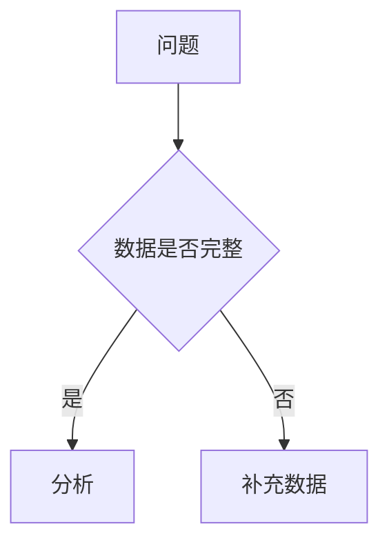
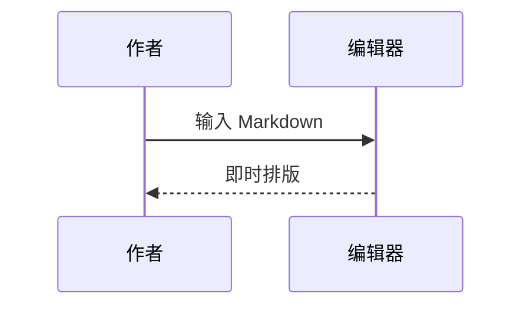
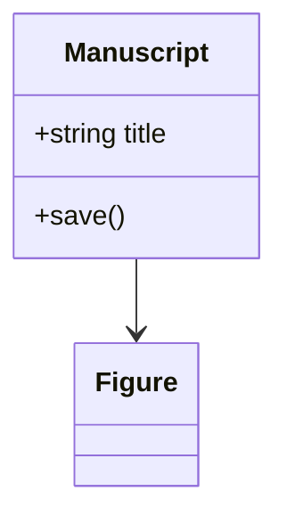
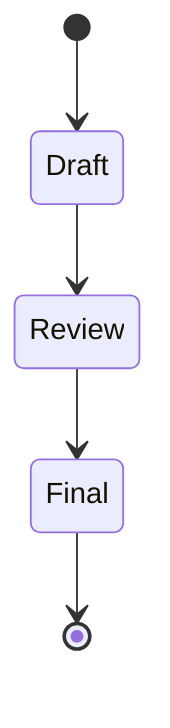
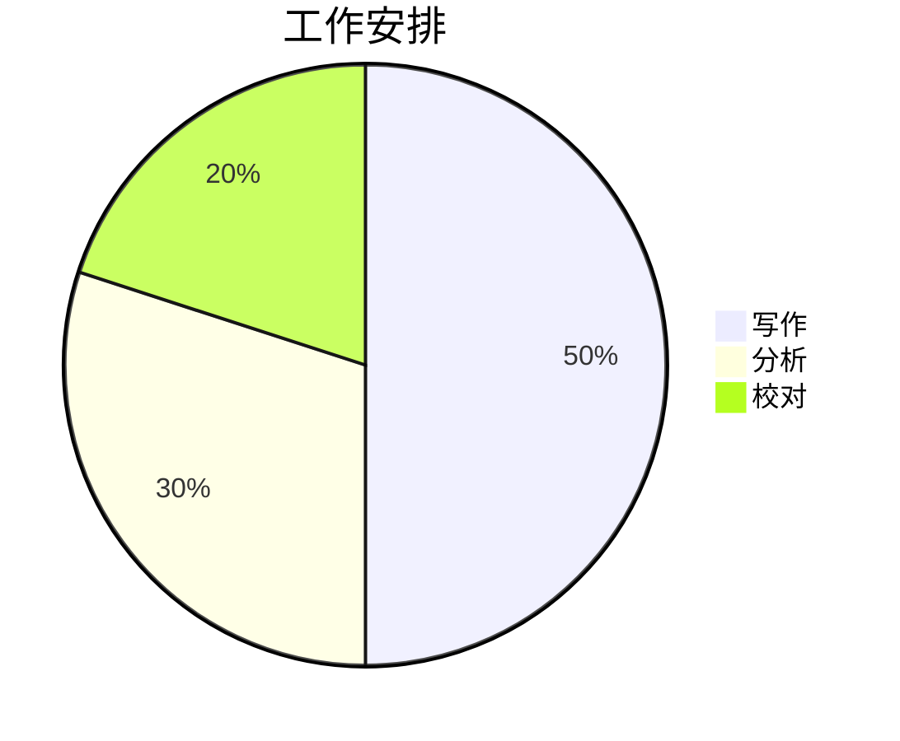
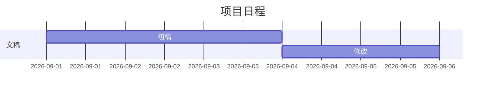
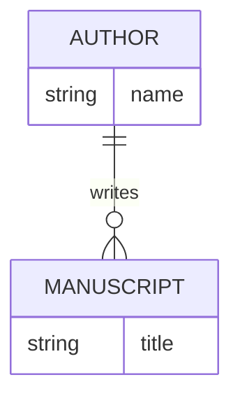

# 从草稿到论文

<!-- toc -->
- [从草稿到论文](#从草稿到论文)
<!-- /toc -->

## 段落与行内元素

**加粗**、*斜体*、~~删除线~~、<u>下划线</u>、<mark>重点</mark>、`inline code`、<kbd>Ctrl</kbd> + <kbd>S</kbd>。

这是行内公式 $E = mc^2$ 和脚注[^note]。<sup>上标</sup>、<sub>下标</sub>，以及行内注释 <!-- 校对时补充细节 -->。

第一行以反斜杠结束。\
第二行是同一段落的硬换行。

### 三级标题
#### 四级标题
##### 五级标题
###### 六级标题

## 清单与提示

- 材料
  - 子项目
- 方法

1. 建模
2. 验证

- [x] 已完成
- [ ] 待完成

> 引用用于保留上下文。

> [!NOTE]
> 普通说明。

> [!TIP]
> 编辑建议。

> [!IMPORTANT]
> 重要结论。

> [!WARNING]
> 请检查单位。

> [!CAUTION]
> 请保存原始数据。

## 表格

| 样品 | 温度 / K | 结果 |
| :--- | :---: | ---: |
| A | 298 | 1.25 |
| B | 310 | 2.50 |

## 代码与公式

```ts title="analysis.ts"
const samples = [1.25, 2.50];
console.log(samples);
```

```diff title="changes.diff"
- const value = 1;
+ const value = 2;
```

```powershell title="build.ps1"
Write-Output "Build complete"
```

$$
\begin{aligned}
E &= mc^2 \\
f(x) &= \sum_{n=0}^{\infty} \frac{x^n}{n!}
\end{aligned}
$$

## 图表















## 图片与 HTML


<p align="center"></p>

<section class="example"><strong>安全 HTML：</strong>用结构表达内容，点击可编辑源码。</section>

<!-- 作者备注：导出时不显示此注释。 -->

[^note]: 脚注定义保留在 Markdown 中，可以点击引用跳转。

---

[回到顶部](#从草稿到论文) · [查看写作指南](AcademicWriting.md)
